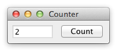

# Counter

**Challenge:** Understanding basic language/toolkit ideas.

Build a UI with:
- a read-only text field or label `T`
- a button `B`

Behavior:
- `T` starts at `0`
- every click on `B` increments `T` by `1`

Focus on minimal scaffolding and clear event/state wiring.
