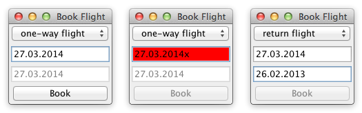

# Flight Booker

**Challenge:** Constraints between controls.

Build a UI with:
- a select `C`: `one-way flight` / `return flight`
- date inputs `T1` (start) and `T2` (return)
- a submit button `B`

Behavior:
- `T2` enabled only when `C` is `return flight`
- if return date is before start date, disable `B`
- invalid date in any enabled field marks field red and disables `B`
- clicking enabled `B` shows a confirmation message
- initial state: `one-way flight`; both dates initialized to same valid date

Focus on explicit, testable constraint logic.
