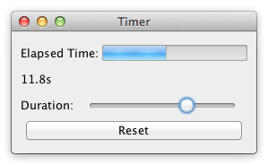

# Timer

**Challenges:** Concurrency, responsiveness, user/signal interactions.

Build a UI with:
- progress gauge `G` for elapsed time `e`
- elapsed time label
- duration slider `S` controlling `d`
- reset button `R`

Behavior:
- timer ticks while `e < d`
- when `e >= d`, timer stops and gauge is full
- adjusting `S` updates `d` immediately (while dragging)
- if stopped and user increases `d` so `d > e`, timer resumes
- `R` resets `e` to `0`

Focus on smooth updates and robust timer lifecycle handling.
