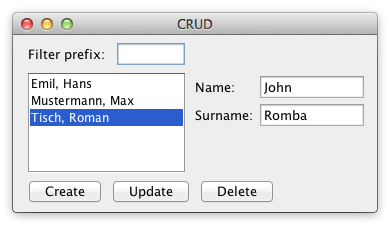

# CRUD

**Challenges:** Domain vs presentation separation, mutation handling, non-trivial layout.

Build a UI with:
- filter input `Tprefix`
- `Tname` and `Tsurname` inputs
- list `L` of names
- buttons: `BC` (create), `BU` (update), `BD` (delete)

Behavior:
- typing `Tprefix` filters list immediately by surname prefix
- `BC` appends `name, surname` from inputs
- `BU` and `BD` enabled only when list selection exists
- `BU` replaces selected entry with new input values
- `BD` removes selected entry
- layout should keep `L` expanding to fill remaining space

Focus on keeping data logic separate from rendering concerns.
