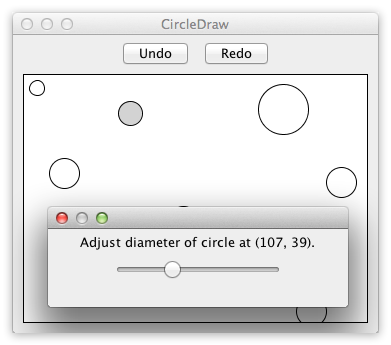

# Circle Drawer

**Challenges:** Undo/redo, custom drawing, dialog control.

Build a UI with:
- Undo and Redo buttons
- drawing canvas

Behavior:
- left-click empty canvas area creates an unfilled fixed-size circle at pointer
- nearest circle under pointer becomes selected (filled gray)
- right-click selected circle opens menu item: `Adjust diameter...`
- selecting it opens a dialog with slider; diameter updates immediately
- closing dialog commits one significant undo step
- undo/redo track significant operations:
  - circle creation
  - diameter adjustment (on dialog close)
- redo history clears when new change is made

Focus on clean history modeling and precise hit-testing.
