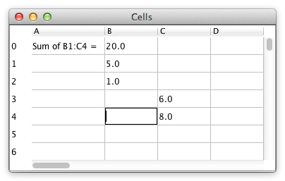

# Cells

**Challenges:** Change propagation, widget customization, larger app structure.

Create a simple spreadsheet UI:
- rows `0..99`
- columns `A..Z`
- scrollable grid

Behavior:
- double-click a cell to edit formula
- after edit, parse/evaluate formula and show value
- reevaluate only dependent cells when a value changes
- continue propagation until values stabilize
- do not use a ready-made spreadsheet control directly; customize a generic table/grid widget

Focus on dependency graph updates and separation of formula engine from UI.
